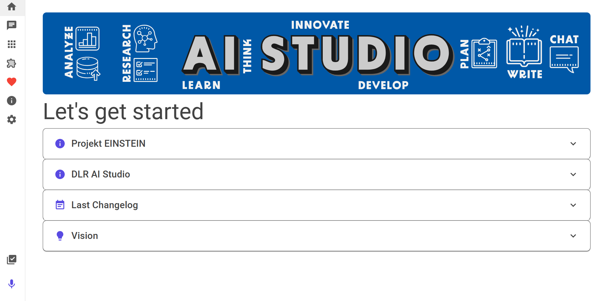
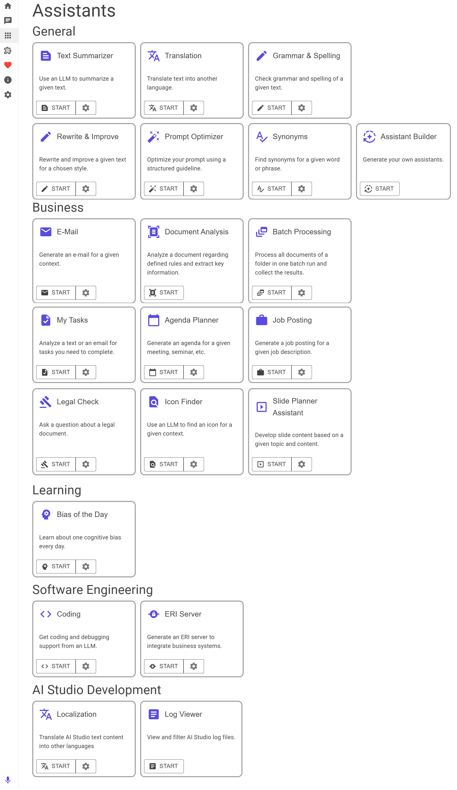

# MindWork AI Studio

Are you new here? [Read here](#what-is-ai-studio) what AI Studio is.

## News

    

    <h3 style="display:inline-block">
        Features we have recently released
    </h3>
    

- v26.9.1: Added local RAG as a beta feature, so the AI can answer from the documents in your own folders and files; added Semantic Search, so a model searches your data sources itself whenever a question calls for it; added tools that AI models can use on their own, starting with Web Search, Read Web Page, and Search Confluence, available in chats, assistants, batch runs, document analysis policies, chat templates, and assistant plugins; added a token count below the message field and knowledge about each model's context window; added support for OpenAI's GPT-6 Astra, Sol, and Luna, and model plugins for organizations that run their own models; you can now copy an entire chat or roll it back to an earlier answer; and expanded enterprise IT support with organization-wide management of tools and of how data sources are searched.
- v26.8.2: Added protection against prompt injection, so hidden instructions in documents, web pages, and retrieved content are removed before a model reads them; added IONOS' AI Model Hub and LiteLLM as providers, along with speech-to-text and embeddings for Hugging Face, Helmholtz Blablador, GroqCloud, and GWDG SAIA; added knowledge about the latest AI models like Claude Opus 5 & Sonnet 5, Gemini 3.6 & 3.7, and Grok 4, and corrected the abilities shown for many models across all providers; added provider logos throughout the app; AI answers can now be exported as Word, OpenDocument, LaTeX, Markdown, or a webpage, with tables saved separately as spreadsheets; greatly reduced memory usage when working with large documents; and expanded enterprise rollouts to cover every kind of plugin.
- v26.8.1: Added Hetzner's EU-hosted inference API as a provider, along with support for the latest open-source models like DeepSeek V4, GLM 5.2, Kimi K2.7 & K3, and Qwen 3.6 & 3.8; added the Visual Briefing Assistant as a preview feature and the Batch Processing Assistant to process entire folders of documents in one run; you can now share, import, and delete plugins; greatly improved working with files, including much better Word and OpenDocument support; expanded enterprise IT support with configuration priorities, test configurations before rollout, and policies for plugin sharing and imports.
- v26.7.3: Added support for the latest OpenAI, Anthropic, and Google models; introduced audio and video transcription, a log viewer assistant, and AI-assisted editing and code management in the Assistant Builder; expanded presentation support with OpenDocument files, speaker notes, comments, and metadata; and improved Linux integration, enterprise update controls, and reliability after waking from sleep.
- v26.7.1: Added the assistant builder as a beta preview for creating assistant plugins without coding; assistants can now keep running in the background; improved provider capability visibility and expert overrides, expanded enterprise controls for data source behavior and trusted assistant plugins, and made chats, assistants, and source links more reliable.
- v26.6.2: Expanded enterprise configuration options with chat defaults, custom introduction panels, trust settings for data security, and managed confidence levels; added auto-backups for app settings & the possibility to view managed profiles and chat templates.
- v26.6.1: Increased enterprise configuration capacity for large organizations, broader Flatpak deployment support, startup and Linux package diagnostics, chat search across all workspaces, improved workspace workflows, better model discovery for self-hosted llama.cpp providers, and fixes for profile and chat template updates, workspace naming, and startup behavior.
- v26.5.5: Released voice recording and transcription for all users; added support for multiple chats running at the same time, export options for profiles, chat templates, and ERI data sources, organization-managed ERI servers, and configurable request timeouts; upgraded the native runtime to Tauri v2.
- v26.4.1: Added support for the latest AI models, assistant plugins, a slide planner assistant, a prompt optimization assistant, math rendering in chats, and a configurable start page; released the document analysis assistant and improved enterprise deployment, chat performance, file attachments, and reliability across voice recording, logging, and provider validation.
- v26.2.2: Added Qdrant as a building block for our local RAG preview, added an embedding test option to validate embedding providers, and improved enterprise and configuration plugins with preselected providers, additive preview features, support for multiple configurations, and more reliable synchronization.
- v26.1.1: Added the option to attach files, including images, to chat templates; added support for source code file attachments in chats and document analysis; added a preview feature for recording your own voice for transcription; fixed various bugs in provider dialogs and profile selection.
- v0.10.0: Added support for newer models like Mistral 3 & GPT 5.2, OpenRouter as LLM and embedding provider, the possibility to use file attachments in chats, and support for images as input.
 

## What is AI Studio?

MindWork AI Studio is a free desktop app for macOS, Windows, and Linux. It provides a unified user interface for interaction with Large Language Models (LLM). AI Studio also offers so-called assistants, where prompting is not necessary. You can think of AI Studio like an email program: you bring your own API key for the LLM of your choice and can then use these AI systems with AI Studio. Whether you want to use Google Gemini, OpenAI GPT-6, or even your own local AI models.

**Ready to get started 🤩?** [Download the appropriate setup for your operating system here](documentation/Setup.md).

**Key advantages:**
- **Free of charge**: The app is free to use, both for personal and commercial purposes.
- **Democratization of AI**: We want to contribute to the democratization of AI. MindWork AI Studio runs even on low-cost hardware, including computers around 100 € such as Raspberry Pi. This makes the app and its full feature set accessible to people and families with limited budgets. You can start with local LLMs or use affordable cloud models.
- **Independence**: You are not tied to any single provider. Instead, you can choose the providers that best suit your needs. Right now, we support:
  - [OpenAI](https://openai.com/) (GPT-6, GPT-5, o3, etc.)
  - [Perplexity](https://www.perplexity.ai/)
  - [Mistral](https://mistral.ai/)
  - [Anthropic](https://www.anthropic.com/) (Claude)
  - [Google Gemini](https://gemini.google.com)
  - [xAI](https://x.ai/) (Grok)
  - [DeepSeek](https://www.deepseek.com/en)
  - [Alibaba Cloud](https://www.alibabacloud.com) (Qwen)
  - [OpenRouter](https://openrouter.ai/)
  - [Hetzner](https://experiments.hetzner.com) (experimental inference API running open-source models in the EU)
  - [IONOS](https://cloud.ionos.com/managed/ai-model-hub) (AI Model Hub running open-source models in Germany)
  - [LiteLLM](https://www.litellm.ai/) (an AI gateway you run yourself, in front of models from many providers)
  - [Hugging Face](https://huggingface.co/) using their [inference providers](https://huggingface.co/docs/inference-providers/index) such as Cerebras, Nebius, Sambanova, Novita, Hyperbolic, Together AI, Fireworks, Hugging Face
  - Self-hosted models using [llama.cpp](https://github.com/ggerganov/llama.cpp), [ollama](https://github.com/ollama/ollama), [LM Studio](https://lmstudio.ai/), and [vLLM](https://github.com/vllm-project/vllm)
  - [Groq](https://groq.com/)
  - [Fireworks](https://fireworks.ai/)
  - For scientists and employees of research institutions, we also support [Helmholtz](https://helmholtz.cloud/services/?serviceID=d7d5c597-a2f6-4bd1-b71e-4d6499d98570) and [GWDG](https://gwdg.de/services/application-services/ai-services/) AI services. These are available through federated logins like eduGAIN to all 18 Helmholtz Centers, the Max Planck Society, most German, and many international universities.
- **Assistants**: You just want to quickly translate a text? AI Studio has so-called assistants for such and other tasks. No prompting is necessary when working with these assistants.
- **Tools**: AI models can use tools on their own, such as Web Search, Read Web Page, or Search Confluence. When you ask something a model cannot answer from what it knows, it looks it up and answers with the sources it used. You decide which tools a model may use, and you can watch it work.
- **Voice input**: Dictate your messages instead of typing them, and have your recordings as well as audio and video files transcribed. You choose the transcription provider, including one you host yourself.
- **Unrestricted usage**: Unlike services like ChatGPT, which impose limits after intensive use, MindWork AI Studio offers unlimited usage through the providers API.
- **Cost-effective**: You only pay for what you use, which can be cheaper than monthly subscription services like ChatGPT Plus, especially if used infrequently. But beware, here be dragons: For extremely intensive usage, the API costs can be significantly higher. Unfortunately, providers currently do not offer a way to display current costs in the app. Therefore, check your account with the respective provider to see how your costs are developing. When available, use prepaid and set a cost limit.
- **Privacy**: You can control which providers receive your data using the provider confidence settings. For example, you can set different protection levels for writing emails compared to general chats, etc. Additionally, most providers guarantee that they won't use your data to train new AI systems.
- **Enterprise IT**: Your IT department can manage AI Studio centrally: roll out providers, assistants, chat templates, and tools, set defaults, or lock settings for the whole organization. [Here's how it works.](documentation/Enterprise%20IT.md)
- **Flexibility**: Choose the provider and model best suited for your current task.
- **No bloatware**: The app requires minimal storage for installation and operates with low memory usage. Additionally, it has a minimal impact on system resources, which is beneficial for battery life.

## **Ready to get started 🤩?** [Download the appropriate setup for your operating system here](documentation/Setup.md).

    

    <h2 style="display:inline-block">
        Support the Project
    </h2>
    

Thank you for using MindWork AI Studio and considering supporting its development 😀. Your support helps keep the project alive and ensures continuous improvements and new features.

We offer various ways you can support the project:

- **Monthly Support**: By contributing a monthly amount, you can significantly help us maintain and develop the project. As a token of our appreciation, we will include your name or company logo in the app. While we cannot guarantee exclusive content at this time, we are working towards offering unique perks in the future.

- **One-Time Contributions**: Make a one-time donation and have your name or company logo included in the app as a gesture of our gratitude.

For companies, sponsoring MindWork AI Studio is not only a way to support innovation but also a valuable opportunity for public relations and marketing. Your company's name and logo will be featured prominently, showcasing your commitment to using cutting-edge AI tools and enhancing your reputation as an innovative enterprise. [Our sponsoring guide](documentation/Sponsoring.md) explains how it works, from delivering your logo to what sponsoring includes.

To view all available tiers, please visit our [GitHub Sponsors page](https://github.com/sponsors/MindWorkAI).
Your support, whether big or small, keeps the wheels turning and is deeply appreciated ❤️.

    

    <h2 style="display:inline-block">
        Planned Features
    </h2>
    

Here's an exciting look at some of the features we're planning to add to AI Studio in future releases:
- **Integrating your data**: You'll be able to integrate your data into AI Studio, like your PDF or Office files, or your Markdown notes.
- **Integration of enterprise data:** It will soon be possible to integrate data from the corporate network using a specified interface ([External Retrieval Interface](https://github.com/MindWorkAI/ERI), ERI for short). This will likely require development work by the organization in question.
- **Useful assistants:** We'll develop more assistants for everyday tasks.
- **Writing mode:** We're integrating a writing mode to help you create extensive works, like comprehensive project proposals, tenders, or your next fantasy novel.
- **Specific requirements:** Want an assistant that suits your specific needs? We aim to offer a plugin architecture so organizations and enthusiasts can implement such ideas.
- **Voice control:** You'll interact with the AI systems using your voice. To achieve this, we want to integrate voice input (speech-to-text) and output (text-to-speech). However, later on, it should also have a natural conversation flow, i.e., seamless conversation.
- **Content creation:** There will be an interface for AI Studio to create content in other apps. You could, for example, create blog posts directly on the target platform or add entries to an internal knowledge management tool. This requires development work by the tool developers.
- **Email monitoring:** You can connect your email inboxes with AI Studio. The AI will read your emails and notify you of important events. You'll also be able to access knowledge from your emails in your chats.
- **Browser usage:** We're working on offering AI Studio features in your browser via a plugin, allowing, e.g., for spell-checking or text rewriting directly in the browser.

Stay tuned for more updates and enhancements to make MindWork AI Studio even more powerful and versatile 🤩.

If you're interested in learning more about future plans, check out our [roadmap](https://github.com/orgs/MindWorkAI/projects/2/views/3) and our [planning issues](https://github.com/MindWorkAI/Planning/issues).

    

    <h2 style="display:inline-block">
        Building
    </h2>
    

You want to know how to build MindWork AI Studio from source? [Check out the instructions here](documentation/Build.md).

Do you want to add or maintain model-driven tools? [Read the tool development guide here](documentation/Tools.md).

Do you want to teach AI Studio what a model can do? [Read the model capabilities guide here](documentation/Models.md).

    

    <h2 style="display:inline-block">
        Contributing
    </h2>
    

Would you like to contribute to AI Studio? We welcome pull requests. We build AI Studio with AI coding agents, and we recommend that you do the same. Please read our [contribution guidelines](CONTRIBUTING.md) before you start: they explain when to ask us first, what a pull request needs, and what you agree to when you submit one.

Did you find a security vulnerability? Please follow our [security policy](SECURITY.md) and never report it publicly. Everyone taking part in our community follows our [Code of Conduct](CODE_OF_CONDUCT.md).

    

    <h2 style="display:inline-block">
        Enterprise IT
    </h2>
    

Do you want to manage AI Studio centrally from your IT department? Yes, that’s possible. [Here’s how it works.](documentation/Enterprise%20IT.md)

    

    <h2 style="display:inline-block">
        License
    </h2>
    

MindWork AI Studio is licensed under the `FSL-1.1-MIT` license (functional source license). Here’s a simple rundown of what that means for you:
- **Permitted Use**: Feel free to use, copy, modify, and share the software for your own projects, educational purposes, research, or even in professional services. The key is to use it in a way that doesn't compete with our offerings.
- **Competing Use**: Our only request is that you don't create commercial products or services that replace or compete with MindWork AI Studio or any of our other offerings.
- **No Warranties**: The software is provided "as is", without any promises from us about it working perfectly for your needs. While we strive to make it great, we can't guarantee it will be free of bugs or issues.
- **Future License**: Good news! The license for each release of MindWork AI Studio will automatically convert to an MIT license two years from its release date. This makes it even easier for you to use the software in the future.

Contributions from outside the core team are licensed to us under the MIT License, see our [contribution guidelines](CONTRIBUTING.md#licensing-of-your-contribution) and the [NOTICE](NOTICE.md) file.

For more details, refer to the [LICENSE](LICENSE.md) file. This license structure ensures you have plenty of freedom to use and enjoy the software while protecting our work.

    

    <h2 style="display:inline-block">
        Trademarks
    </h2>
    

The license above covers our own software. It says nothing about the trademarks of other companies, so here is where AI Studio stands on those.

AI Studio ships the logos of the AI providers it supports and shows them next to the matching provider entry, so you can see at a glance which service a provider connects to. All product names, logos, and trademarks are the property of their respective owners. Their use here identifies compatible services and implies no endorsement, sponsorship, or business relationship between MindWork AI Studio and these companies.

Some of these logos come from the [Simple Icons](https://github.com/simple-icons/simple-icons) project, which publishes them under [CC0-1.0](https://github.com/simple-icons/simple-icons/blob/16.21.0/LICENSE.md); the trademarks themselves are not part of that release. The remaining ones were taken from the official brand resources of the respective provider. The source of every single file is documented in [the provider icon notes](app/MindWork%20AI%20Studio/wwwroot/images/provider-icons/README.md). All logos ship with AI Studio and are loaded from your device, so showing one never sends a request to the provider.

Organizations can replace these logos with their own icons through a configuration plugin. When an organization does so, it is responsible for holding the rights to the icons it provides.

